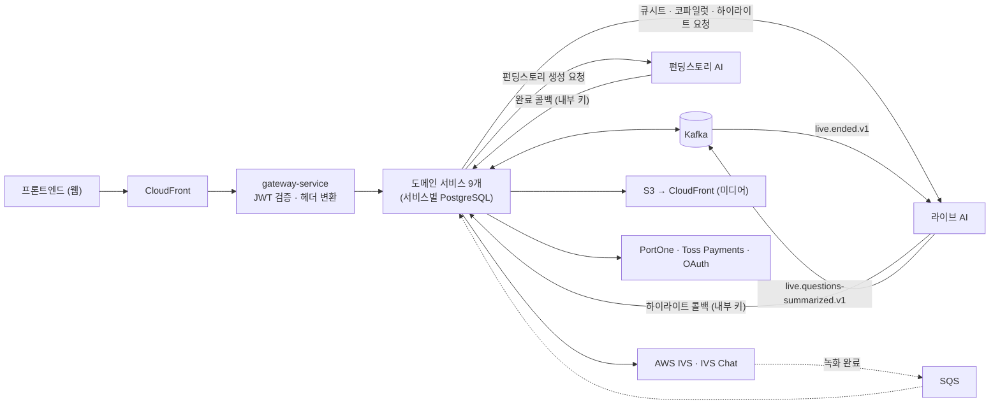
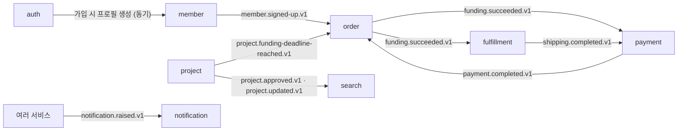

# Fundit Backend

리워드형 크라우드펀딩과 라이브커머스를 합친 플랫폼 **Fundit**의 백엔드입니다. 서비스 9개와 게이트웨이 1개로 이뤄진 MSA이고, Gradle 멀티모듈 모노레포로 관리합니다.

## 프로젝트 소개

펀딩 상품은 일반 이커머스보다 사전 정보와 사용 경험이 부족해서 정보 비대칭이 큽니다.

- 구매자: 상세 정보만으로는 실제 성능과 품질을 판단하기 어려워 참여를 망설이거나 이탈합니다.
- 판매자: 제품의 가치를 효과적으로 전달하기 어렵고, 상세페이지 제작이 진입장벽이 됩니다.

Fundit은 이 문제를 아래 기능으로 나눠 풉니다.

| 해결 방향 | 담당 서비스 | 기능 |
| :--- | :--- | :--- |
| 실시간 검증(LIVE)으로 정보 비대칭·불신 해소 | `live-service` | LIVE 방송, AI 큐시트(방송 전 준비), AI 라이브 코파일럿(방송 중 Q&A 지원), 하이라이트 |
| LIVE에서 검증된 정보를 휘발시키지 않고 축적 | `project-service` | LIVE 검증 탭(방송을 못 본 사람도 신뢰 정보 확인) |
| 판매자의 상세페이지 제작 부담 완화 | `project-service` | 펀딩스토리 AI(상세페이지 초안 생성) |
| 펀딩 후 배송 불확실성 해소 | `fulfillment-service` | 제작·배송 5단계 진행 현황 |

자세한 요구사항과 서비스 간 흐름은 [PRD](./docs/PRD.md)에 있습니다.

## 기술 스택

| 구분 | 사용 기술 |
| :--- | :--- |
| 언어·프레임워크 | Java 25, Spring Boot 4.1.1, Spring Data JPA, Spring Security(auth) |
| 게이트웨이 | Spring Cloud Gateway(WebFlux), JWT(RS256) 검증 |
| 데이터 | PostgreSQL(서비스별 DB), Flyway, Redis(auth) |
| 메시징 | Apache Kafka |
| AWS | IVS·IVS Chat(라이브 송출·채팅), S3·CloudFront(미디어), SQS(녹화 완료 이벤트) |
| 외부 연동 | PortOne(본인인증), Toss Payments(결제), Kakao·Google OAuth(소셜 로그인) |
| 테스트 | JUnit 6, Testcontainers(PostgreSQL·Kafka), JaCoCo |
| CI/CD | GitHub Actions(서비스별 CI), Amazon ECR 이미지 푸시 |

## 시스템 구성

프론트엔드, 백엔드, AI 서버가 연결되는 방식입니다. 배포 인프라(클러스터·네트워크·모니터링)는 인프라팀이 관리하므로, 아래 그림에는 백엔드 코드가 직접 연결되는 지점만 담았습니다.



- **FE → BE**: 모든 요청은 게이트웨이 하나로 들어옵니다. 게이트웨이는 JWT를 검증한 뒤 `X-User-Id`/`X-User-Roles` 헤더로 바꿔 서비스에 넘기고, 내부 전용 경로(`/internal/**` 등)는 외부에서 막습니다.
- **BE → AI**
  - `project-service`가 펀딩스토리 AI를 호출합니다.
  - `live-service`가 라이브 AI(코파일럿, 큐시트, 하이라이트)를 호출합니다.
  - 동기 호출에는 모두 타임아웃을 둡니다.
- **AI → BE**: AI 서버는 두 경로로 결과를 돌려줍니다.
  - 내부 콜백: 예를 들어 `POST /internal/ai/runs/{runId}/completion`, `POST /internal/v1/lives/{liveId}/highlights`. 공유 키 헤더 `X-Internal-Api-Key`로 인증합니다.
  - Kafka 이벤트: 방송 종료(`live.ended.v1`)를 받아 질문 요약을 만들고, 그 결과를 `live.questions-summarized.v1`로 발행합니다.

## 서비스 구성

| 서비스 | 역할 | 로컬 포트 | 문서 |
| :--- | :--- | :--- | :--- |
| `platform:gateway-service` | 라우팅, JWT 검증, 내부 경로 차단 | 8080 | [구현 요약](./platform/gateway-service/docs/GatewayImplementationSummary.md) |
| `auth-service` | 로그인, 본인인증, 토큰 발급·회전, 계정(자격증명) | 8081 | [API](./services/auth-service/docs/AuthDomainApiSpec.md) · [기능](./services/auth-service/docs/AuthFunctionalSpec.md) |
| `member-service` | 회원 프로필, 구매자/판매자 모드, 약관, 찜, 팔로우, 배송지 | 8082 | [API](./services/member-service/docs/MemberDomainApiSpec.md) · [기능](./services/member-service/docs/MemberFunctionalSpec.md) |
| `project-service` | 프로젝트, 리워드, 커뮤니티, 새소식, 후기, 심사, 펀딩스토리 AI | 8083 | [API](./services/project-service/docs/ProjectDomainApiSpec.md) · [기능](./services/project-service/docs/ProjectDomainFunctionalSpec.md) |
| `order-service` | 펀딩 참여, 주문서, 재고 차감, 목표 달성 판정, 쿠폰 | 8084 | [API](./services/order-service/docs/OrderDomainApiSpec.md) · [기능](./services/order-service/docs/OrderFunctionalSpec.md) |
| `payment-service` | 결제 승인·취소, 환불, 정산 | 8085 | [API](./services/payment-service/docs/PaymentApiSpec.md) · [기능](./services/payment-service/docs/PaymentFunctionalSpec.md) |
| `live-service` | 방송 송출, 실시간 채팅, AI 큐시트·코파일럿, 하이라이트, 다시보기 | 8086 | [API](./services/live-service/docs/LiveDomainApiSpec.md) · [기능](./services/live-service/docs/LiveFunctionalSpec.md) |
| `fulfillment-service` | 제작·배송 5단계 진행 현황, 발송 정보 | 8087 | [API](./services/fulfillment-service/docs/FulfillmentApiSpec.md) · [기능](./services/fulfillment-service/docs/FulfillmentFunctionalSpec.md) |
| `notification-service` | 알림 적재·발송, 수신 설정 | 8088 | [API](./services/notification-service/docs/NotificationDomainApiSpec.md) · [기능](./services/notification-service/docs/NotificationFunctionalSpec.md) |
| `search-service` | 홈 피드, 카테고리 탐색, 키워드 검색 | 8089 | [API](./services/search-service/docs/SearchDomainApiSpec.md) · [기능](./services/search-service/docs/SearchDomainFunctionalSpec.md) |

서비스마다 DB를 따로 둡니다. 다른 서비스의 테이블은 직접 읽지 않고, API를 호출하거나 이벤트로만 데이터를 주고받습니다. 대표적인 흐름은 아래와 같습니다.



전체 토픽 목록과 발행·구독 서비스는 [`KafkaTopics`](./modules/common/src/main/java/com/fundit/common/event/KafkaTopics.java)에 있습니다.

## 모듈 구조

```
fundit-backend/
├── modules/
│   ├── common/          # 서비스 경계를 넘는 계약 (에러 응답, 인증 헤더 이름, Kafka 토픽 이름) — 순수 Java
│   └── common-webmvc/   # Servlet 서비스 공용 (예외 핸들러, @LoginUser, 내부 키 필터)
├── platform/
│   └── gateway-service/ # Spring Cloud Gateway (WebFlux)
├── services/            # 도메인 서비스 9개
│   └── {service}/
│       ├── docs/                # API·기능 명세
│       ├── docker-compose.yml   # 로컬 DB
│       └── src/main/java/.../
│           ├── presentation/    # 컨트롤러, 요청·응답 DTO
│           ├── application/     # 유스케이스, 아웃바운드 포트
│           ├── domain/          # 도메인 모델, 레포지토리 인터페이스 (JPA·Spring 무의존)
│           └── infrastructure/  # JPA 엔티티, 어댑터, 외부 연동, 설정
├── docs/                # 프로젝트 공통 문서 (PRD, 워크플로, CI 가이드)
├── infra/docker/        # 서비스 공용 런타임 Dockerfile
└── docker-compose.yml   # 로컬 Kafka
```

서비스는 `modules:common-webmvc`에 의존하고, `modules:common`은 그 의존을 통해 함께 들어옵니다. 게이트웨이는 리액티브 스택이라 `common-webmvc`를 쓰지 않고 `modules:common`만 씁니다.

## 핵심 설계 포인트

- **게이트웨이에서 인증하고, 서비스는 내부 키로 출처를 확인합니다.** 게이트웨이가 JWT를 검증해 사용자 헤더로 바꿉니다. 서비스는 `InternalGatewaySecretFilter`로 게이트웨이를 거친 요청인지 확인한 뒤에만 그 헤더를 믿습니다. 그래서 게이트웨이를 건너뛰고 서비스 포트에 직접 헤더를 위조해 보내도 통하지 않습니다. → [게이트웨이 구현 요약](./platform/gateway-service/docs/GatewayImplementationSummary.md)
- **공용 모듈에는 스택 간 계약만 둡니다.** 헤더 이름과 토픽 이름은 한쪽만 바뀌어도 예외 없이 조용히 깨집니다. 실제로 헤더 이름을 양쪽이 리터럴로 따로 들고 있다가 회원가입이 전부 실패한 적이 있습니다. 그래서 이런 값만 `modules:common`의 상수로 공유하고, 비즈니스 로직은 넣지 않습니다. → [CLAUDE.md](./CLAUDE.md)
- **서비스 간 통신은 API와 이벤트로만 합니다.** 서비스마다 DB가 따로 있고, 동기 호출에는 반드시 타임아웃을 둡니다. 이벤트 토픽 이름은 `{도메인}.{사건}.v{N}` 규칙을 따릅니다. → [이벤트 규칙](./.claude/rules/event-convention.md) · [설정 규칙](./.claude/rules/config-convention.md)
- **도메인 모델은 프레임워크에 의존하지 않습니다.** `domain` 패키지에는 JPA·Spring 애노테이션을 붙이지 않고, 매핑은 `infrastructure`에서만 합니다. → [영속성 규칙](./.claude/rules/persistence-convention.md)

## 로컬 실행

**사전 요구**: JDK 25, Docker

```bash
# 1. Kafka (루트)
docker compose up -d

# 2. 실행할 서비스의 DB
docker compose -f services/{service}/docker-compose.yml up -d

# 3. 설정 파일 작성 — src/main/resources/application-local.yml
#    .gitignore 대상이라 저장소에 없습니다. 필요한 키는 같은 폴더의 application-dev.yml을 참고해 로컬 값으로 채웁니다.

# 4. 실행
./gradlew :services:{service}:bootRun
```

- 서비스마다 로컬 앱 포트와 DB 포트가 정해져 있어서 여러 서비스를 함께 띄워도 충돌하지 않습니다(앱 8080~8089, DB 5432~5440). 기준은 [설정 규칙](./.claude/rules/config-convention.md)입니다.
- 메트릭은 각 서비스의 로컬 앱 포트 `/actuator/prometheus`에 노출됩니다. dev·prod에서는 관리 포트 `8081`로 분리됩니다.
  - 로컬 확인: `docker compose up -d prometheus grafana`를 실행하고 Prometheus `localhost:9090/targets`, Grafana `localhost:3000`(admin/admin)에 접속합니다.
  - Grafana 대시보드는 ID로 import합니다: JVM `4701`, Spring Boot `19004`.
- OpenAPI 문서는 `GET /api/v1/{도메인}/api-docs.yaml`에서 받을 수 있습니다(예: `/api/v1/members/api-docs.yaml`). 운영 프로필에서는 닫혀 있습니다.

## 빌드·테스트

```bash
./gradlew build                        # 전체 빌드
./gradlew :services:{service}:build    # 서비스 하나만 빌드
./gradlew test                         # 전체 테스트
./gradlew :services:{service}:test     # 서비스 하나만 테스트
./gradlew jacocoTestReport             # 커버리지 리포트 (build/reports/jacoco/)
```

통합 테스트는 Testcontainers로 PostgreSQL과 Kafka를 띄우므로 Docker가 실행 중이어야 합니다.

## 문서

| 문서 | 내용 |
| :--- | :--- |
| [PRD](./docs/PRD.md) | 전체 요구사항, 서비스 간 핵심 흐름 |
| [개발 워크플로 가이드](./docs/development-workflow-guide.md) | 브랜치 전략, 새 서비스 추가 절차, Gradle 규칙 |
| [CI 워크플로 가이드](./docs/ci-workflow-guide.md) | 서비스별 CI 작성 방법과 템플릿 |
| [CLAUDE.md](./CLAUDE.md) | 프로젝트 개요와 금지 사항 |

**공통 규칙** (`.claude/rules/`)

| 규칙 | 내용 |
| :--- | :--- |
| [api-convention](./.claude/rules/api-convention.md) | URL, 요청·응답 형식 |
| [error-handling](./.claude/rules/error-handling.md) | 에러 코드와 예외 처리 |
| [security](./.claude/rules/security.md) | 인증·인가, 민감 정보 처리 |
| [persistence-convention](./.claude/rules/persistence-convention.md) | 도메인·JPA 분리, 마이그레이션 |
| [config-convention](./.claude/rules/config-convention.md) | 프로필, 포트, 환경변수 |
| [event-convention](./.claude/rules/event-convention.md) | Kafka 토픽, 이벤트 형식 |
| [test-convention](./.claude/rules/test-convention.md) | 테스트 작성 규칙 |

## 팀원·담당

|  |  |
| :---: | :---: |
| **김재성**<br>[@semolu99](https://github.com/semolu99) | **강상욱**<br>[@sangwookkhu](https://github.com/sangwookkhu) |
| auth, member, live,<br>notification, gateway·공통 모듈 | project, order, payment,<br>fulfillment, search |

- 펀딩스토리 AI 연동(project)은 두 사람이 함께 작업했고, AI 연동 흐름과 로컬 스텁은 [@pakyeon](https://github.com/pakyeon)이 작업했습니다.

## 협업 규칙

- `main`(배포)과 `develop`(통합)에는 PR로만 머지합니다.
- 작업 브랜치는 `develop`에서 `{type}/{설명}#{이슈번호}` 형식으로 만듭니다(예: `feat/ai-chat-image-attachments#233`).
- 커밋은 Conventional Commits(`feat:`, `fix:`, `refactor:`, `test:`, `docs:`)를 따르고, 제목은 20자 이내로 씁니다.

자세한 내용은 [개발 워크플로 가이드](./docs/development-workflow-guide.md)에 있습니다.
